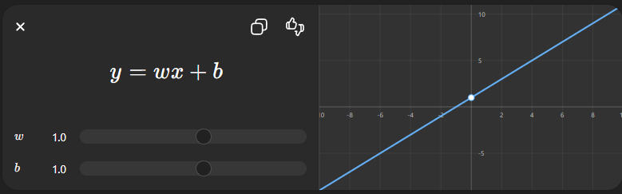
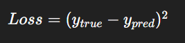
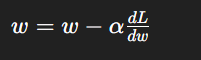
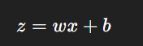
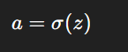
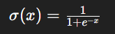

## Most important Hierarchy:

```bash
Artificial Intelligence (AI)
↓
Machine Learning (ML)
↓
Deep Learning (DL)
↓
Computer Vision (Application Area)
```

## 1. Artificial Intelligence (AI) — Deep Understanding

### What is AI?

AI means:

    Making machines behave intelligently like humans.

### Types of AI

```bash
|-------------------------------------------------------------|
|Type            |Meaning                                     |
|----------------|--------------------------------------------|
|Narrow AI       |Does one task (e.g., face detection)        |
|General AI      |Human-level intelligence (not achieved yet) |
|-------------------------------------------------------------|
```

### How AI Works (Conceptually)

AI systems:

1. Take input (image, text, data)
2. Process it
3. Make a decision

Example:

CCTV → detects motion → triggers alert

## 2. Machine Learning (ML) — Core Foundation

### What is ML?

ML allows computers to learn from data instead of being explicitly programmed

### Types of ML

```bash
1. Supervised Learning
   Data + labels
   Example: Image → “Human” or “Not Human”
2. Unsupervised Learning
   No labels
   Finds patterns
3. Reinforcement Learning
   Learns by trial & error (like a game)
```

> Core Mathematical Idea (VERY IMPORTANT)

Let’s understand the basic ML formula:

    Linear Model:



_Figure 1: Basic ML formula_

### Explanation:

```bash
|---------------------------------------------|
|Symbol     |Meaning                          |
|x          |Input (image features, pixels)   |
|w          |Weight (importance of input)     |
|b          |Bias (adjustment value)          |
|y          |Output (prediction)              |
|---------------------------------------------|
```

### Why this formula?

Because:

- It helps map input → output
- ML models try to learn w and b

### Loss Function (Error Calculation)

Model needs to know: “How wrong am I?”

Example:



_Figure 2: Example_

### Explanation:

- If prediction is wrong → loss increases
- If prediction is correct → loss is small

> Goal:

    Minimize this loss

### Optimization (Learning Process)

Model updates weights using:

> Gradient Descent



_Figure 3: Gradient Descent_

Explanation:

```bash
|-------------------------------------------|
|Term           |Meaning                    |
|w              |weight                     |
|α (alpha)      |learning rate              |
|dL/dw          |slope (how error changes)  |
|-------------------------------------------|
```

### Why?

- Moves weights in the direction that reduces error
- This is how the model “learns”

## 3. Deep Learning (DL) — Advanced ML

### What is DL?

    Deep Learning = Machine Learning using Neural Networks

> Neural Network Concept

Inspired by the human brain:

```bash
Input → Hidden Layers → Output
```

Core Formula

Each neuron:



Then activation:



Explanation

- First calculate weighted sum
- Then apply activation function

> Activation Function Example

Sigmoid:



### Why activation?

Without activation:

- Model becomes just linear (weak)

With activation:

- Can learn complex patterns (VERY IMPORTANT)

## 4. What is Computer Vision (CV)?

**Computer Vision** is a technology that helps computers **see and understand images and videos**, just like humans do.

---

#### What is CV?

Applying Deep Learning to images/videos

### In Simple Words

Computer Vision allows a computer to:

- Look at images or videos
- Understand what is inside (like people, objects, movement)
- Make decisions based on that information

---

### How It Works (Basic Idea)

It uses:

- **Artificial Intelligence (AI)**
- **Machine Learning (ML)**
- **Deep Learning**

to recognize patterns and identify objects.

---

### Example

- A CCTV camera detecting a person → **Computer Vision**
- Face unlock on your phone → **Computer Vision**
- Self-driving car recognizing roads → **Computer Vision**

---

### Is Computer Vision AI or ML?

- Computer Vision is a **part of AI**
- It uses **Machine Learning & Deep Learning** to work

---

Key Tasks in CV

```bash
|--------------------------------------------------------|
|Task	                    |Meaning                     |
|Image Classification	    |What is in image            |
|Object Detection	        |Where is object             |
|Segmentation	            |Pixel-level understanding   |
|--------------------------------------------------------|
```

### সহজ বাংলায়

কম্পিউটার ভিশন হলো এমন একটি প্রযুক্তি, যা কম্পিউটারকে **ছবি ও ভিডিও দেখে বুঝতে সাহায্য করে।**

এটি ব্যবহার করে:

- মানুষ বা বস্তু শনাক্ত করা
- নড়াচড়া বোঝা
- গুরুত্বপূর্ণ তথ্য বের করা

---

### Most Important Model: CNN (Convolutional Neural Network)

> Convolution Operation

    Output=Input∗Kernel

Explanation

- Kernel = small filter (like edge detector)
- Slides over image
- Extracts features (edges, shapes)

### Why CNN?

Because:

- Images have spatial structure
- CNN captures patterns like:
  - edges
  - textures
  - shapes

## 5. How Everything Works Together

```bash
AI → Goal (detect intruder)
ML → Learn from data
DL → Use neural networks
CV → Apply on images/videos
```

## 6. When to Use What?

```bash
|-----------------------------------|
|Situation	                |Use    |
|Small data	                |ML     |
|Large image/video data	    |DL     |
|Visual tasks	            |CV     |
|Decision systems	        |AI     |
|-----------------------------------|
```

## 7. For YOUR CCTV Project

You will mainly use:

- Computer Vision
- Deep Learning
- Model: CNN / YOLO (later)

> What You Should Do Next

I suggest this structured learning path:

```bash
Step 1:
ML basics (done above)

Step 2:
Neural networks deeply (next lesson)

Step 3:
CNN deeply (VERY important for you)

Step 4:
Object detection (YOLO)
```
